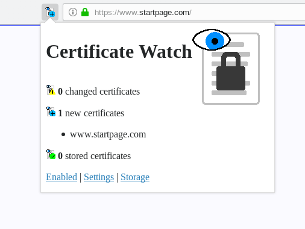
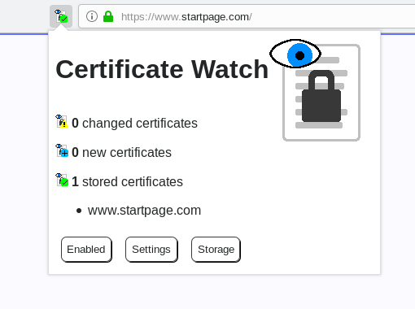
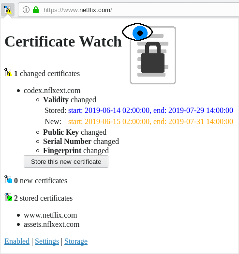

Certificate Watch
=================

[Install for Firefox](https://addons.mozilla.org/en-US/firefox/addon/certwatch/)

This is a WebExtensions primarly built for Firefox. IT watches over the TLS
certificates that websites present to you and warns when the certificate for a
domain changes. If a new domain is encountered, its certificate is added to the
local storage of this add-on. Future connections to that domain will check that
the certificate is still the same as in the local storage.

The add-on icon can display three possible states:
*  **Stored:** The certificate of the domain is the
  same as the one in storage.
*  **New:** There is no previous certificate stored for
  this domain; the new one is automatically added to the storage.
*  **Changed:** The certificate of the connection is
  different to the one in storage. This means, that the certificate of the website was changed. A click on the add-on icon will display more information and has the option to accept the new certificate into the local storage (overriding the old certificate).

This add-on can be a countermeasure to attacks where the attacker has a valid
certificate for the attacked website. Changes to the certificate that the
browser happily accepts can no longer go unnoticed. The goal of this
countermeasure is simply to make the user aware that something has changed; user
intervention is still required.

Screenshots
-----------
The certificate of a new domain is automatically added to the storage:

The certificate of a domain matches the one in storage:

The certificate of a domain differs from the one in storage:

Caveats
-------
* This add-on does not check that certificates are valid. The browser does this
  already. This add-on only compares certificates of connections that the
  browser deems safe.
* This add-on does not block any requests where the certificate has changed. It
  only informs the user of this fact. If the add-on displays a changed
  certificate, it is up to the user to decide what to do (e.g. leave the page,
  accept the certificate, or something else).
* This add-on implements Trust On First Use (TOFU): the first certificate that
  is encountered for a domain is automatically trusted. Only future changes will
  raise a warning.
* Users of this add-on should already have basic knowledge of how certificates
  for TLS connections work. The warnings generated by this add-on only make
  sense if the user can correctly interpret them.
